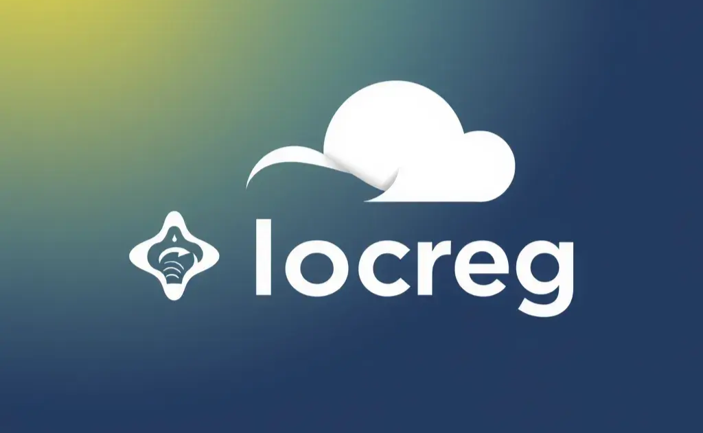

# Introduction

`locreg` makes deploying containerized applications to cloud simple and free of container registry charge. 

`locreg` provides a simple way to create local container registry and cloud resources to host your app in desired cloud. Currently, supported cloud container deployment platforms include Azure Container Instances and Azure App services.
Its core focus is to provide you with secure and free local storage for your images that can be easily use for cloud resources deployment.

As `locreg` is a cloud-agnostic solution, you can use it with any cloud provider you want to easily provision Internet-facing container registry via tunnel.

---

> Check [install](./install.md) to see how to install `locreg` and start using it. 

---

## What's next?
## What's next?
- Use [getting started](./getting_started.md) guide to see how to use `locreg` to deploy your app.
- Get familiar with `locreg` using [locreg CLI](./cli/locreg.md) guide.
- Get familiar with `locreg` [configuration options](./configuration.md)
